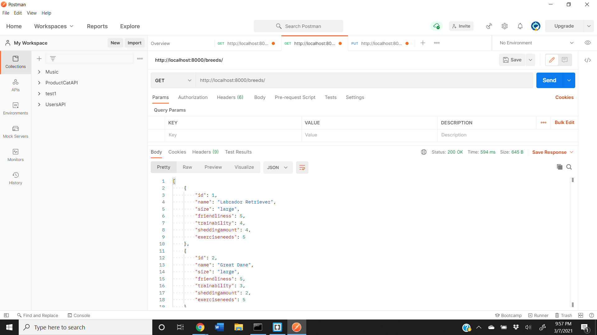

# Django REST API Assignment

## Introduction

For this assignment I have created a basic Django Rest Api

## Specification for REST Api
The dogAPI endpoint, allows an end user to create a new `Dog` model by making a `POST` to `api/dogs`, view current dogs that have been saved to the server before by making a `GET` to `/api/dogs`, and get, modify, or delete an existing `Dog` record by making a `GET`, `PUT`, or `DELETE` request (respectively) to `/api/dogs/<id>` where `<id>` is the id of the `Dog`  record to be retrieved, modified, or deleted.

The `Dog` includes a foreign key to the `Breed` endpoints for dog breed at `/api/breeds/` and `/api/breeds/<id>`. 

### Dog model

- name (a character string)
- age (an integer)
- breed (a foreign key to the Breed Model)
- gender (a character string)
- color (a character string) 
- favoritefood (a character string)
- favoritetoy (a character string)

### Breed Model

- name (a character string)
- size (a character string) [should accept Tiny, Small, Medium, Large]
- friendliness (an integer field) [should accept values from 1-5]
- trainability (an integer field) [should accept values from 1-5]
- sheddingamount (an integer field) [should accept values from 1-5]
- exerciseneeds (an integer field) [should accept values from 1-5]

### What I did 

 - added a `Dog` and `Breed` models to models.py
 - generated new migrations
 - migrated database to include tables for `Dog` and `Breed`
 - Used ModelViewSet
 - Tested the API    
### Test Screenshots
Add a New Dog !

All Dog List !

Dog Delete/Update !

Add a New Dog Breed !

All Dog Breeds !

Dog Breed Delete/Update !

